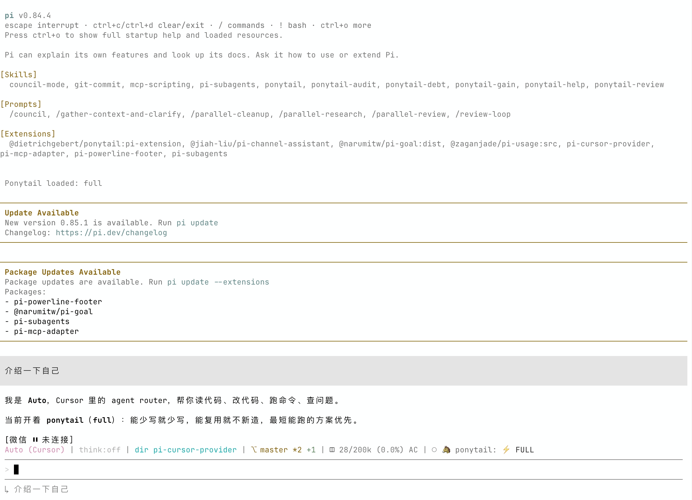

<div align="center">
  

  [English](README.md) | **简体中文**
</div>

# pi-cursor-provider

[](https://www.typescriptlang.org/)
[](LICENSE)
[](https://nodejs.org)
[](https://github.com/badlogic/pi-mono)
[](https://cursor.com)

这是一个 [Pi Coding Agent](https://github.com/badlogic/pi-mono) 自定义提供商，通过 **Cursor Agent CLI** 转发模型请求，让你可以在 Pi 内使用 Cursor 订阅所提供的任意模型——Claude（Opus、Sonnet）、GPT、Gemini、Grok 等。

这些模型本身不需要单独的 API 密钥。身份验证由 Cursor CLI 使用你现有的 Cursor 账户完成。

本项目以 [`@jiah-liu/pi-cursor-provider`](https://www.npmjs.com/package/@jiah-liu/pi-cursor-provider) 发布，是 [`@netandreus/pi-cursor-provider`](https://github.com/netandreus/pi-cursor-provider) 的一个分支。



---

## 目录
- [pi-cursor-provider](#pi-cursor-provider)
  - [目录](#目录)
  - [前置要求](#前置要求)
  - [安装](#安装)
    - [选项 A — 从 npm 安装（推荐）](#选项-a--从-npm-安装推荐)
    - [选项 B — 从源码安装](#选项-b--从源码安装)
    - [选项 C — 无需安装即可试用](#选项-c--无需安装即可试用)
  - [卸载](#卸载)
    - [选项 A — 从 npm 安装（推荐）](#选项-a--从-npm-安装推荐-1)
    - [选项 B — 从源码安装](#选项-b--从源码安装-1)
  - [身份验证](#身份验证)
    - [首次设置](#首次设置)
    - [Pi 内的身份验证命令](#pi-内的身份验证命令)
    - [验证身份](#验证身份)
  - [用法](#用法)
  - [可用模型](#可用模型)
    - [模型同步](#模型同步)
    - [模型参考表](#模型参考表)
  - [配置](#配置)
  - [工作原理](#工作原理)
  - [工具调用](#工具调用)
  - [为 Pi 中的 Cursor Agent 安装并启用 MCP 工具](#为-pi-中的-cursor-agent-安装并启用-mcp-工具)
  - [图像输入](#图像输入)
  - [限制](#限制)
  - [故障排除](#故障排除)
  - [参考资料](#参考资料)
  - [许可证](#许可证)


---

## 前置要求

| 要求 | 详情 |
|---|---|
| [Pi Coding Agent](https://github.com/badlogic/pi-mono) | `npm install -g @mariozechner/pi-coding-agent`（v0.53.0+；推荐 v0.77+） |
| [Cursor Agent CLI](https://cursor.com/docs/cli/overview) | 已安装且位于 `PATH` 中（或设置 `CURSOR_AGENT_PATH`）。已使用 CLI `2026.08.11` 测试。 |
| Cursor 账户 | 免费或付费账户；可用模型取决于你的订阅 |

---

## 安装

### 选项 A — 从 npm 安装（推荐）

```bash
pi install npm:@jiah-liu/pi-cursor-provider
```

或者安装到当前项目：

```bash
pi install npm:@jiah-liu/pi-cursor-provider -l
```

### 选项 B — 从源码安装

在仓库根目录执行：

```bash
git clone https://github.com/jiah-liu/pi-cursor-provider.git
cd pi-cursor-provider
pi install .
```

### 选项 C — 无需安装即可试用

```bash
pi -e npm:@jiah-liu/pi-cursor-provider
```

## 卸载

### 选项 A — 从 npm 安装（推荐）
```bash
pi remove npm:@jiah-liu/pi-cursor-provider
```

### 选项 B — 从源码安装
```bash
# You can find installed path right after running "pi"
pi remove ~/sandbox/pi-cursor-provider
```
---

## 身份验证

提供商将身份验证完全委托给 Cursor CLI。你的 Cursor 凭据由 CLI 自行存储和管理（`~/.cursor/`）。

从 Pi 0.77 起，此提供商不再要求设置 `CURSOR_API_KEY`：只需运行 `agent login`。仅当你想向 CLI 传递控制面板密钥时才设置 `CURSOR_API_KEY`。

### 首次设置

```bash
# Option 1 — Interactive browser-based login (recommended)
agent login

# Option 2 — API key
export CURSOR_API_KEY=your_cursor_api_key
```

如果设置了 `CURSOR_API_KEY`，每个 `agent` 子进程都会继承它，且不会在命令行参数中暴露。

### Pi 内的身份验证命令

加载扩展后，无需离开 Pi 即可管理身份验证。这些命令会出现在命令面板中（例如输入 `/cur` 时）：

| 命令 | 说明 |
|---|---|
| `/cursor-login` | 登录 Cursor（运行 `agent login`） |
| `/cursor-status` | 显示 Cursor 身份验证状态（运行 `agent status`） |
| `/cursor-logout` | 退出 Cursor（运行 `agent logout`） |
| `/cursor-permissions` | 为当前 Pi 进程选择工作区信任和写入权限 |

在未设置 `CURSOR_AGENT_TRUST=1` 的情况下选择 Cursor 模型时，交互式 Pi 会在首次请求前询问工作区权限。该选择仅更新当前 Pi 进程；如需持久化默认值，请使用下方的环境变量。

### 验证身份

```bash
agent status
# or inside Pi:
# /cursor-status
```

身份验证成功时的预期输出：
```
 ✓ Logged in as you@example.com
```

---

## 用法

加载扩展后，使用 `/model` 命令选择 Cursor 模型：

```
/model cursor/auto
/model cursor/composer-2.5
/model cursor/claude-opus-4-8
/model cursor/gpt-5.5
/model cursor/gemini-3.1-pro
```

也可以在命令行中指定模型：

```bash
pi -e npm:@jiah-liu/pi-cursor-provider --provider cursor --model auto
```

或者通过管道以非交互方式传入提示词：

```bash
echo "Explain the main function in this file" | \
  pi -e npm:@jiah-liu/pi-cursor-provider --provider cursor --model claude-opus-4-8
```

---

## 可用模型

扩展启动时会运行 `agent models`，从你的 Cursor 订阅中发现**账户专属**的模型列表。该列表会在 Pi 会话的整个生命周期内缓存。

### 模型同步

Pi 启动时会自动获取 Cursor 的新模型。在已有的交互式会话中，运行 `/reload` 即可刷新。这要求已安装的 Cursor Agent CLI 和你的账户能够通过 `agent models` 提供该模型；通常无需更新此 npm 包。

Cursor CLI 现在提供许多参数化变体（effort、thinking、fast）。提供商会**将它们归为模型家族**，让 `/model` 保持易用——例如，`claude-opus-4-8-thinking-high-fast` 会注册为 `cursor/claude-opus-4-8`。Pi 的推理级别会映射回相应的 CLI 变体。

如果发现失败（例如 CLI 未安装、未通过身份验证或超时），则只注册内置的 `auto` 后备模型——不会崩溃，也不会使用过时的模型列表。

要查看你的账户当前可用的模型：

```bash
agent models
```

带有 thinking 或多个 effort 变体的模型在 Pi 中会标记为推理模型。CLI 不会公开令牌限制，因此未知模型采用保守的 200k / 32k 默认值。

`claude-sonnet-4-6` 或 `sonnet-4.6` 等旧 ID 仍会解析到当前家族。

### 模型参考表

以下是部分模型家族。通过 `/model cursor/<id>` 使用**家族 ID**。实时列表来自 `agent models`。

| 家族 ID | CLI ID 示例 | 名称 |
|---|---|---|
| `auto` | `auto` | Auto |
| `composer-2.5` | `composer-2.5`, `composer-2.5-fast` | Composer 2.5 |
| `claude-opus-4-8` | `claude-opus-4-8-medium`, `…-thinking-high` | Claude Opus 4.8 |
| `claude-opus-5` | `claude-opus-5-medium`, `…-thinking-high` | Claude Opus 5 |
| `claude-sonnet-5` | `claude-sonnet-5-medium`, `…-thinking-high` | Claude Sonnet 5 |
| `claude-4.6-sonnet` | `claude-4.6-sonnet-medium`, `…-thinking` | Claude Sonnet 4.6 |
| `claude-4.6-opus` | `claude-4.6-opus-high`, `…-thinking` | Claude Opus 4.6 |
| `gpt-5.5` | `gpt-5.5-medium`, `gpt-5.5-high` | GPT-5.5 |
| `gpt-5.4` | `gpt-5.4-medium`, `gpt-5.4-high` | GPT-5.4 |
| `gpt-5.3-codex` | `gpt-5.3-codex`, `…-high`, `…-fast` | Codex 5.3 |
| `gpt-5.2` | `gpt-5.2`, `gpt-5.2-high` | GPT-5.2 |
| `cursor-grok-4.6` | `cursor-grok-4.6-medium`, `…-high-fast` | Cursor Grok 4.6 |
| `gemini-3.1-pro` | `gemini-3.1-pro` | Gemini 3.1 Pro |
| `gemini-3.7-flash` | `gemini-3.7-flash-medium` | Gemini 3.7 Flash |
| `kimi-k3` | `kimi-k3-high`, `kimi-k3-max` | Kimi K3 |

---

## 配置

| 环境变量 | 默认值 | 说明 |
|---|---|---|
| `CURSOR_AGENT_PATH` | `agent` | Cursor Agent CLI 二进制文件的完整路径。 |
| `AGENT_PATH` | `agent` | 未设置 `CURSOR_AGENT_PATH` 时的后备值。 |
| `CURSOR_API_KEY` | *（无）* | 由 CLI 进程继承的 Cursor API 密钥。 |
| `CURSOR_AGENT_FORCE` | *（禁用）* | 设为 `1` 以传递 `--force`，允许在 print 模式下写入。也可通过 `/cursor-permissions` 更改。 |
| `CURSOR_AGENT_TRUST` | *（禁用）* | 设为 `1` 以传递 `--trust --approve-mcps`。交互式 Pi 会在需要时询问；`/cursor-permissions` 可再次更改。 |
| `CURSOR_AGENT_TIMEOUT_MS` | `600000` | 单个 CLI 请求的最长持续时间；低于 1000 的值会被忽略。 |

示例：

```bash
export CURSOR_AGENT_PATH=$HOME/.local/bin/agent
pi -e npm:@jiah-liu/pi-cursor-provider --provider cursor --model auto
```

---

## 工作原理

每轮 Pi 对话都会启动一个 Cursor Agent CLI 子进程：

```
agent --print --output-format stream-json --stream-partial-output \
  --model <id> --workspace <cwd>
# CURSOR_AGENT_FORCE=1 adds --force; CURSOR_AGENT_TRUST=1 adds --trust --approve-mcps
# CURSOR_AGENT_TIMEOUT_MS sets a per-request timeout (default: 600000)
```

提示词写入 **stdin**（而非 argv），因此长会话不会触及 Linux 的 `MAX_ARG_STRLEN` / `E2BIG` 限制。CLI 的 NDJSON 标准输出会被逐行读取；流式 `assistant` 增量映射为 Pi 的 `text_*` 事件，`tool_call` 事件则成为 `thinking_*` 跟踪。重复的缓冲区刷新（`model_call_id` / 不含 `timestamp_ms` 的最终刷新）会被跳过；不断增长的文本快照会转换为后缀增量。

- **多轮上下文**：完整消息历史会序列化为带前缀的对话记录（`[User] / [Assistant] / [Tool result]`），并作为单个提示词发送。之后由 Cursor 管理其内部对话。
- **安全默认值**：默认禁用写入和 MCP 自动批准。设置 `CURSOR_AGENT_FORCE=1` 以允许写入，设置 `CURSOR_AGENT_TRUST=1` 以信任工作区并批准 MCP 工具。
- **令牌用量**：Cursor CLI 不公开令牌数量；用量报告为 0。
- **成本跟踪**：模型注册时使用 `cost: 0`，因为计费通过你的 Cursor 订阅进行。

---

## 工具调用

当 Cursor CLI 在一轮对话中使用工具（Read、Write、Shell、Grep、Ls、Glob 等）时，扩展会将它们显示为助手段落之间的 **Pi 思考跟踪**，而不是混入答案文本的 `⏳` 行。

所有工具均由 **Cursor CLI 自行执行**。它们不会作为 Pi `toolCall` 块发出，否则 Pi 会尝试再次运行这些工具。如果你只想查看最终文本，请在 Pi 中隐藏思考过程。

Pi 输出中会显示以下受支持的 Cursor CLI 工具：

| CLI 事件键 | 显示名称 |
|---|---|
| `shellToolCall` | Shell |
| `readToolCall` | Read |
| `editToolCall` | Edit |
| `writeToolCall` | Write |
| `deleteToolCall` | Delete |
| `grepToolCall` | Grep |
| `globToolCall` | Glob |
| `lsToolCall` | Ls |
| `todoToolCall` | Todo |
| `webFetchToolCall` | WebFetch |
| `webSearchToolCall` | WebSearch |
| `function`（MCP / 通用） | 载荷中的工具 `name` |

---

## 为 Pi 中的 Cursor Agent 安装并启用 MCP 工具

要在 Cursor Agent 代表 Pi 运行时使用 Pi 相关的 MCP 工具（例如 `pi-auto`），请连接 MCP 服务器、为 agent 启用它，并在 CLI 配置中允许其工具。

### 1. 将 MCP 服务器连接到 agent

将服务器添加到 `~/.cursor/mcp.json`。以下是 `pi-auto` 的示例：

```bash
cat ~/.cursor/mcp.json
```

```json
{
  "mcpServers": {
    "pi-auto": {
      "command": "pi-auto-mcp",
      "lifecycle": "keep-alive",
      "directTools": true
    }
  }
}
```

### 2. 启用 MCP 服务器

列出 MCP 服务器；新服务器需要批准：

```bash
agent mcp list
```

示例输出：
```
pi-auto: not loaded (needs approval)
```

启用并批准服务器：

```bash
agent mcp enable pi-auto
```

示例输出：
```
✓ Enabled and approved MCP server: pi-auto
```

验证工具是否可用：

```bash
agent mcp list-tools pi-auto
```

示例输出：
```
Tools for pi-auto (8):
- pi_get_priority ()
- pi_get_provider (scope, projectPath)
- pi_get_strategy ()
- pi_get_usage (period)
- pi_set_priority (priority)
- pi_set_provider (provider, model, scope, projectPath)
- pi_set_strategy (strategy)
- pi_suggest_provider (period)
```

### 3. 允许使用此 MCP 的工具

确保 `~/.cursor/cli-config.json` 允许 MCP 工具。例如：

```json
"permissions": {
  "allow": [
    "Shell(ls)",
    "Mcp(pi-auto:*)"
  ],
  "deny": []
}
```

`Mcp(pi-auto:*)` 允许 agent 使用 `pi-auto` 服务器提供的任意工具。

---

## 图像输入

Cursor Agent CLI 从提示词中的文件路径读取图像。当 Pi 消息包含图像时：

- 如果内容块已有文件系统 `path`，则直接传递该路径。
- 否则，提供商会将图像字节写入临时文件，并在提示词中包含该路径。

模型注册时使用 `input: ["text", "image"]`。本轮对话结束时会删除临时文件。

---

## 限制

- 多轮历史记录会序列化为纯文本；非常长的对话可能超出模型的上下文窗口。
- 令牌用量始终报告为 0（Cursor CLI 不公开令牌数量）。

---

## 故障排除

| 症状 | 可能原因 | 解决方法 |
|---|---|---|
| `spawn agent ENOENT` | `agent` 二进制文件不在 PATH 中 | 设置 `CURSOR_AGENT_PATH=/path/to/agent` |
| `Workspace Trust Required` | Cursor CLI 尚未信任当前目录 | 在自动提示中选择一个选项，或运行 `/cursor-permissions` |
| 响应为空 / 卡住 | 未登录 Cursor，或 print 模式正在等待批准 | 运行 `agent login` 或设置 `CURSOR_API_KEY`；仅启用所需的 `CURSOR_AGENT_FORCE=1` / `CURSOR_AGENT_TRUST=1` 标志。只有确定任务耗时较长时才增大 `CURSOR_AGENT_TIMEOUT_MS`。 |
| `No API key found for cursor` | Pi 0.77+ 曾要求设置 `CURSOR_API_KEY` | 将此提供商升级到 0.2.0+；只需运行 `agent login`。 |
| `spawn E2BIG` | 旧版提供商将提示词放在 argv 中 | 升级此提供商；提示词现在通过 stdin 传入。 |
| `No models available` | Cursor CLI 无法访问 API | 检查网络连接和 `agent status` |
| 特定模型报错 | 你的订阅不包含该模型 | 运行 `agent models` 查看可用模型 |
| NDJSON 解析错误 | CLI 输出异常 | 检查 stderr；更新 Cursor Agent CLI |

---

## 参考资料

- [Cursor Agent CLI — 概览](https://cursor.com/docs/cli/overview)
- [Pi](https://pi.dev/)

---

## 许可证

[MIT](LICENSE)
